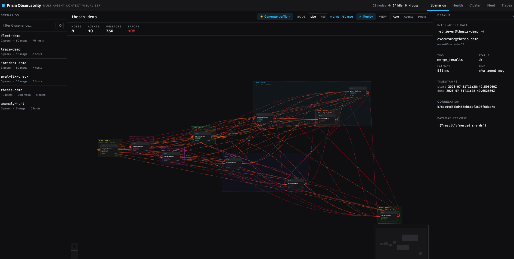

# ChronoLog Observability

[](https://github.com/annamonso/context-visualizer/actions/workflows/ci.yml)
[](./LICENSE)
[](https://www.python.org/downloads/)

**Observability for multi-agent LLM systems running across a cluster.** Existing
tracing tools answer *"what did my agent do?"* — one run, one machine, a span
tree. This answers *"what is my agent **fleet** doing across the cluster, and
which node is dragging it down?"* by coupling agent semantics to physical
cluster topology and per-node health.

It stores nothing of its own: every view is reconstructed from
[ChronoLog](https://github.com/grc-iit/ChronoLog) stories, using the shared log
as a native causal substrate.



### 🎬 [Watch the demo](https://youtu.be/H_CoekzZsks)

Seven real Claude Agent SDK agents across four cluster nodes, delegating to each
other over MCP — observed live: the scenario graph, node-to-node traffic, the
fleet heatmap, and ChronoDoctor catching a failure.

---

## Try it in 60 seconds

No cluster, no API keys, no cost:

```bash
git clone https://github.com/annamonso/context-visualizer.git
cd context-visualizer

pip install -e .
make workspace                              # build the React SPA

python3 scripts/demos/demo_doctor.py        # seed some data to look at
CHRONOLOG_OFFLINE=1 chronolog-observe        # http://localhost:5000
```

Two more seeders worth running: `demo_fleet_scale.py` (100 nodes summarised in
milliseconds) and `demo_tracing.py` (find the bottleneck hop in a 6-host mesh).

For a real deployment, see **[docs/deployment.md](./docs/deployment.md)**.

## What you get

| Tab | Answers |
|---|---|
| **Scenarios** | Which agents are talking to which, on which physical nodes, right now |
| **Health** | What is failing, why, and how often it has failed before |
| **Cluster** | The ChronoLog deployment topology plus live node-to-node traffic |
| **Fleet** | Which of my 100+ nodes are unhealthy, as a heatmap |
| **Traces** | Why this cross-host scenario is slow, and which hop is the long pole |

Three analyses do the heavy lifting:

- **ChronoDoctor** — scans every story for failures (HTTP 4xx/5xx, latency
  outliers, retry storms, failed *and hung* inter-agent calls), **clusters them
  by signature** so a fleet-wide symptom is one ranked incident instead of 500
  rows, and attaches a root cause, a remediation and a blast radius. Diagnosis is
  a deterministic heuristic engine by default (zero cost); `CHRONOLOG_DOCTOR_LLM=1`
  swaps in a Claude-backed diagnoser. A self-compacting incident memory makes
  repeat offenders recognisable **across runs**.
- **Fleet Health** — per-`(host, minute)` rollup buckets make the fleet overview
  `O(nodes × buckets)` instead of `O(events)`, so the heatmap stays instant at
  100+ nodes, where a node-link graph becomes unreadable past ~12.
- **Critical-path tracing** — reconstructs cross-host call trees from inter-agent
  edges and computes the critical path, naming the bottleneck hop by *self-time*
  (exclusive wall-clock), which correctly ignores the parent/child overlap that
  would otherwise double-count.

## How it works

Two capture paths feed ChronoLog; the dashboard reads back from it.

```
agents ──Path-A (LLM turns)──▶ spool ──capture worker──▶ ChronoLog stories ─┐
       ──Path-B (agent calls)─▶ per-node collector ─────▶ ChronoLog keeper ─┤
                                                                            ▼
                                                          dashboard (reads ChronoLog
                                                          + a local hot store for live)
```

**Why the hot store.** ChronoLog is the durable cold path, but it is unreadable
in real time: the keeper→grapher drain lags ~180 s, and a `ReplayStory` against
an un-drained story blocks the process for *minutes* while holding the GIL. So
live views are served from a local hot store written at ingest, and ChronoLog
stays the source of truth for everything already drained.

**The adapter seam.** Data sources are discovered at runtime through the
`chronolog_observability.adapters` entry-point group. Blueprints declare the
`Capability` they need, and the app factory mounts only what some active adapter
can serve — so a third party can add a data source without forking.

```
src/chronolog_observability/
├── app.py            # Flask factory: discover adapters, mount blueprints, serve SPA
├── backend/          # ChronoLog substrate (client, constants, reader)
├── adapters/         # the data-source seam + story→graph shapers
├── capture/          # Path-A spool & sync worker; Path-B store & live bus
├── collector/        # per-node collector daemon
├── api/              # Flask blueprints, one per capability
├── analysis/         # tracing, call graphs, context graphs
├── diagnostics/      # ChronoDoctor
└── fleet/            # rollups and health store
```

The React dashboard lives in `frontend/` (Vite) and builds into the Python
package, so a wheel ships with the UI.

## Documentation

| Document | What is in it |
|---|---|
| [docs/deployment.md](./docs/deployment.md) | Offline and live setup, capture wiring, operational notes, troubleshooting |
| [docs/features.md](./docs/features.md) | Complete feature reference — every tab, every script |
| [docs/data-schemas.md](./docs/data-schemas.md) | The ChronoLog story schemas every view is reconstructed from |
| [docs/evaluation.md](./docs/evaluation.md) | Evaluation methodology and measured results |
| [CONTRIBUTING.md](./CONTRIBUTING.md) | Development setup, checks, architecture constraints |
| [CLAUDE.md](./CLAUDE.md) | Repo guide for AI coding agents |

Interactive explainers: [architecture](./docs/assets/architecture-diagram.html) ·
[ChronoLog workarounds](./docs/assets/chronolog-workarounds.html) ·
[data flow](./docs/assets/demo-dataflow.html)

## Status

A research prototype from a master's thesis, functional and validated
end-to-end. Real agents on live 4-node and 8-node ChronoLog clusters pass 28/28
checks across all tabs including the scenario→conversation click-through.
Real-time observation of inter-agent comms, node-to-node traffic and agent
working memory was verified with both synthetic and real Claude agents.

The full thesis — design rationale, related work and the complete evaluation —
is in [`thesis/main.pdf`](./thesis/main.pdf).

## Citing

```bibtex
@mastersthesis{monso2026observability,
  author   = {Monsó Rodriguez, Anna},
  title    = {Distributed Observability for Multi-Agent {LLM} Systems:
              A Shared-Log Approach on {HPC} Clusters},
  school   = {Illinois Institute of Technology},
  address  = {Chicago, Illinois},
  year     = {2026},
  note     = {https://github.com/annamonso/context-visualizer}
}
```

## License

MIT — see [LICENSE](./LICENSE).
